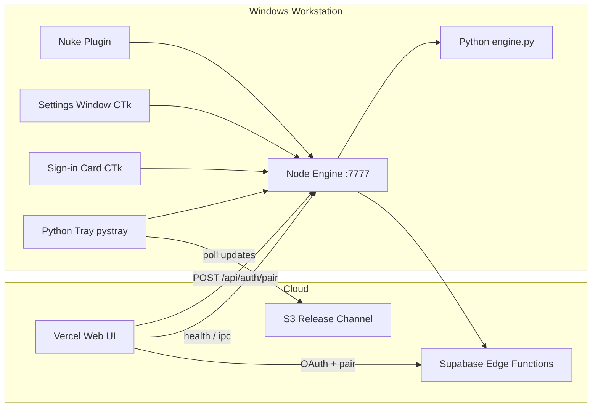

# CTrack Publish — Development Status

**Last updated:** 2026-06-01

This document summarizes what has been built so far in `ctrack_publish_web`, the local engine, workstation GUI, web pairing flow, Supabase backend, and Nuke integration. For deployment steps see [DEV_AND_DEPLOY.md](./DEV_AND_DEPLOY.md). For **hybrid MinIO + S3 storage** see [DUAL_STORAGE.md](./DUAL_STORAGE.md). For the full architecture plan see [systematic_plan.md](./systematic_plan.md).

---

## 1. Executive summary

| Area | Status | Notes |
|------|--------|-------|
| **Node engine** (`127.0.0.1:7777`) | Done | Publish queue, transcode, settings, auth, updates, logs |
| **Supabase backend** | Done | Pairing tables + 4 edge functions deployed |
| **Web app (Vercel)** | Done | Main UI + `/link-engine` pairing + install wizard |
| **Hybrid storage (MinIO + S3)** | Done | Publish uploads: MinIO primary + S3 mirror. **Installers:** S3 primary + MinIO backup — [DUAL_STORAGE.md](./DUAL_STORAGE.md) |
| **Python tray + GUI** | Done | Tray, sign-in card, settings, engine console |
| **First-run login UX** | In progress | Works when tray + engine stay running during browser sign-in |
| **Auto-update (tray)** | Done | Startup + **every 24h** poll; manual Check for updates; GitHub Release download via `engine-download` |
| **Nuke plugin** | Done | Minimal menu: Publish Write, Open Engine, Settings |
| **Production release v0.2.0** | Not verified | Acceptance criteria in systematic plan still open |

---

## 2. System architecture (current)



**Data paths**

| Path | Purpose |
|------|---------|
| `%USERPROFILE%\.ctrack-engine\credentials.json` | Device pairing (refresh token, deviceId, userId) |
| `%USERPROFILE%\.ctrack-engine\engine-settings.json` | Engine + tray settings |
| `%USERPROFILE%\.ctrack-engine\ctrack_queue.db` | SQLite publish queue |
| `%USERPROFILE%\.ctrack-engine\tray.lock` | Single-instance tray lock |
| `%USERPROFILE%\.ctrack-engine\login.lock` | Single-instance sign-in card lock |

---

## 3. Node engine (`engine/`)

### Core

- Express server on **`127.0.0.1:7777`** (`engine/src/server.ts`)
- Python sidecar for transcode / EXR / staging (`engine/python/engine.py`)
- SQLite queue manager (`engine/src/queue-manager.ts`)
- S3 / hybrid storage upload (`engine/src/s3-manager.ts`) — MinIO primary + AWS S3 mirror when `STORAGE_PROVIDER=hybrid`
- `GET /api/storage/test` — HeadBucket probe for MinIO and S3 (`npm run test:storage`)
- Legacy Electron IPC bridge (`POST /api/ipc`, `GET /api/stream`)

### Auth & pairing

| Route | Description |
|-------|-------------|
| `GET /api/auth/status` | Paired state, userId, deviceId, email |
| `GET /api/auth/login-url` | Returns `{ url: CTRACK_WEB_URL/link-engine }` |
| `POST /api/auth/pair` | Completes pairing with `pairToken` from edge |
| `POST /api/auth/unpair` | Removes local credentials |
| `POST /api/auth/refresh` | Refreshes device token via edge |

Implementation: `engine/src/auth-store.ts` — reads/writes `~/.ctrack-engine/credentials.json`, calls `engine-pair-complete` edge function.

### Updates

| Route | Description |
|-------|-------------|
| `GET /api/update/check` | Compare local vs remote manifest |
| `POST /api/update/download` | Download installer (requires paired); tries AWS URL then MinIO `backupUrl` |
| `POST /api/update/apply` | Launch silent Inno upgrade |

Tray (`tray_app.py`): polls `/api/update/check` on startup and every **24 hours**; notifies when an update is available.

### Operations & GUI launch

| Route | Description |
|-------|-------------|
| `GET /health` | Engine health + `paired` / `ready` flags |
| `GET /api/logs/tail` | Recent log lines (files + queue events) |
| `GET /api/diagnostics/export` | Support bundle JSON |
| `POST /api/gui/open` | Launch tray / settings / engine console / login card |

### Publish pipeline

| Route | Description |
|-------|-------------|
| `POST /api/publish/enqueue` | Queue a publish job |
| `GET /api/publish/jobs` | List recent jobs |
| `POST /api/publish/jobs/:id/process` | Process one job |
| `POST /api/publish/process-next` | Process next idle job |

Full API reference: [`engine/docs/API.md`](../engine/docs/API.md)

---

## 4. Python workstation GUI (`engine/python/gui/`)

Built with **CustomTkinter** + **pystray**. Embedded Python lives under `engine/runtime/python/`.

### Components

| Module | Role |
|--------|------|
| `tray_app.py` | System tray host — starts Node engine, menu, notifications, **24h update poll** |
| `login_prompt.py` | First-run **sign-in card** — slides up from taskbar, opens browser |
| `settings_window.py` | Full settings UI (General, Account, Review & MP4, Nuke, Tools) |
| `engine_window.py` | Engine console — live logs + recent publish jobs |
| `tray_anim.py` | Vertical slide in/out from tray area |
| `engine_bootstrap.py` | Ensures Node engine is listening before sign-in |
| `instance_lock.py` | Single-instance locks with stale PID recovery |
| `auth_local.py` | Read pairing state from `credentials.json` without HTTP |
| `env_config.py` | Resolve `CTRACK_WEB_URL` from local `.env` files |
| `api.py` | HTTP client for `127.0.0.1:7777` |

### Tray menu

- **Sign in to CTrack…** (default when unpaired)
- Open Engine (logs + jobs console)
- Settings…
- Open web UI
- Start at Windows login
- Restart engine
- Check for updates / Install update
- Quit

### First-run sign-in flow

1. User starts tray: `scripts/start-engine-tray.vbs`
2. Tray starts Node engine; if not paired, launches **sign-in card**
3. Card slides up from bottom-right (taskbar area)
4. User clicks **Sign in** → browser opens `{CTRACK_WEB_URL}/link-engine`
5. User completes Google OAuth on web
6. Web calls `engine-pair-init` → browser **redirects** to `http://127.0.0.1:7777/api/auth/pair-redirect?pairToken=...` (top-level navigation — works where `fetch` to localhost is blocked)
7. Engine writes `credentials.json` and shows “Engine linked” in the browser tab
8. Sign-in card detects pairing → **Connected** → slides down → opens **Settings (Account tab)**

**Critical requirement:** The tray and engine **must stay running** during steps 4–7.

**Web deploy:** The redirect-based link flow requires the updated `LinkEnginePage.tsx` on Vercel (or run local web: `npm run dev:web` and set `CTRACK_WEB_URL=http://localhost:5173` in `engine/.env`).

### Launch scripts

| Script | Action |
|--------|--------|
| `scripts/start-engine-tray.vbs` | Start tray (`pythonw -m gui`) |
| `scripts/open-tray-settings.ps1` / `.vbs` | Open settings window |
| `scripts/open-engine-console.vbs` | Open engine console |
| `scripts/provision-gui-python.ps1` | Install CTk + pystray into embedded Python |

### Second instance behavior

- If tray already running and **not paired** → launches sign-in card (no blocking dialog)
- If tray already running and **paired** → “CTrack tray is already running”
- Stale `tray.lock` / `login.lock` from crashed processes are cleared when PID is dead

---

## 5. Web app (`web/`)

### Pairing page

- **Route:** `/link-engine` (`web/src/pages/LinkEnginePage.tsx`)
- Google OAuth → `engine-pair-init` (edge) → `POST /api/auth/pair` (localhost)
- Shows phases: login → linking → ready / error
- Hook: `web/src/hooks/use-engine-pairing.ts`

### Other web features (from systematic plan)

- `EngineConnectionWizard` — install wizard when engine offline
- `EngineDiagnostics` — connection tests + diagnostic export
- Authenticated installer download via `engine-download` edge function
- Version compare / update banner
- Staging zone, publish queue UI (IPC shim to local engine)

### Environment

```env
VITE_SUPABASE_URL=
VITE_SUPABASE_ANON_KEY=
VITE_ENGINE_URL=http://127.0.0.1:7777
```

Add **`/link-engine`** to Supabase Auth redirect URLs (prod + localhost).

---

## 6. Supabase backend

### Migration

- `ctrack_v0/supabase/migrations/098_engine_release_and_device_auth.sql`
- Mirror: `supabase/migrations/021_engine_release_and_device_auth.sql`

### Tables

- `engine_releases` — release channel metadata
- `engine_devices` — registered workstations
- `engine_pairing_tokens` — short-lived pair tokens
- `engine_device_credentials` — device refresh tokens
- `engine_download_audit` — download audit log

### Edge functions

| Function | Purpose |
|----------|---------|
| `engine-pair-init` | Start pairing (user JWT) → `pairToken` |
| `engine-pair-complete` | Exchange pair token → device credentials |
| `engine-download` | Presigned installer URL (user or device auth) |
| `engine-releases-latest` | Latest release manifest for channel |

Deploy: `npm run deploy:edge` from `ctrack_publish_web/` (see [DEV_AND_DEPLOY.md](./DEV_AND_DEPLOY.md)).

---

## 7. Nuke plugin (`ctrack_nuke/`)

Minimal integration (updated from original README):

| Menu item | Action |
|-----------|--------|
| **Publish Write** | Enqueue selected Write node output via `POST /api/publish/enqueue` |
| **Open Engine** | Opens engine console or sign-in card if unpaired |
| **Settings…** | Opens engine settings via `POST /api/gui/open` |

Files: `menu.py`, `api_client.py`, `init.py`

---

## 8. CI / deploy

| Workflow | Trigger | Actions |
|----------|---------|---------|
| `.github/workflows/ctrack-dev.yml` | Push/PR to `main` / `develop` | Build engine + web, Python syntax check |
| `.github/workflows/ctrack-deploy.yml` | Tag `v*` or manual | Edge functions → GitHub Release + `engine_releases` |

Local scripts: `deploy-dev.ps1`, `deploy-edge-functions.ps1`, `deploy-release.ps1`, `sync-edge-secrets.ps1`, `load-deploy-env.ps1`

---

## 9. Engine environment (`engine/.env`)

Required for pairing and web URL resolution:

```env
VITE_SUPABASE_URL=https://<project>.supabase.co
SUPABASE_URL=https://<project>.supabase.co
CTRACK_WEB_URL=https://ctrackpublishweb.vercel.app
CTRACK_WEB_ORIGINS=https://ctrackpublishweb.vercel.app,http://localhost:5173,http://127.0.0.1:5173
CTRACK_UPDATE_CHANNEL=stable
```

Edge base URL is derived from `SUPABASE_URL` as `{SUPABASE_URL}/functions/v1` unless `CTRACK_EDGE_BASE` is set.

---

## 10. Known gaps & follow-ups

| Item | Status |
|------|--------|
| DPAPI encryption for `credentials.json` | Not implemented (plain JSON on disk) |
| Sign-in card auto-close when engine was down during browser login | Improved (engine bootstrap + file watch); still requires tray running |
| Vercel deploy of latest `/link-engine` error messages | May need redeploy |
| End-to-end acceptance (systematic plan §15) | Not all criteria verified |
| `ctrack_nuke/README.md` | Partially outdated vs current minimal menu |

---

## 11. Quick local test checklist

```powershell
# 1. Build engine
cd d:\dev\track\ctrack_publish_web
npm run build -w engine

# 2. Start tray
wscript scripts\start-engine-tray.vbs

# 3. Verify engine
curl http://127.0.0.1:7777/health
curl http://127.0.0.1:7777/api/auth/status

# 4. Sign in via card → browser → confirm credentials
type %USERPROFILE%\.ctrack-engine\credentials.json

# 5. Dev web (optional)
npm run dev
# Open http://localhost:5173
```

If tray says “already running” but nothing visible:

```powershell
Remove-Item "$env:USERPROFILE\.ctrack-engine\tray.lock" -Force -ErrorAction SilentlyContinue
Remove-Item "$env:USERPROFILE\.ctrack-engine\login.lock" -Force -ErrorAction SilentlyContinue
wscript scripts\start-engine-tray.vbs
```

---

## 12. Related docs

- [DEV_AND_DEPLOY.md](./DEV_AND_DEPLOY.md) — Edge deploy, CI, release tagging
- [systematic_plan.md](./systematic_plan.md) — Full architecture & phases A–F
- [engine/docs/API.md](../engine/docs/API.md) — HTTP API reference
- [README.md](../README.md) — Monorepo setup & dev commands
- [ctrack_nuke/README.md](../../ctrack_nuke/README.md) — Nuke install
