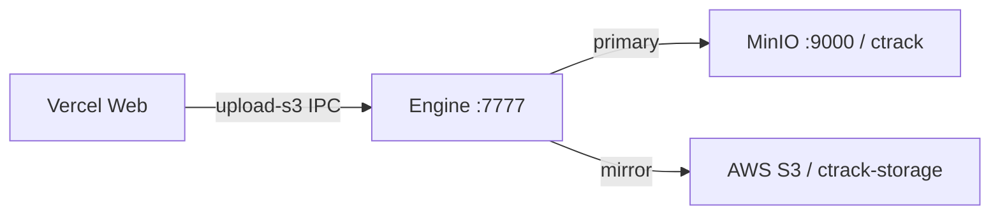

# Dual storage (MinIO + AWS S3)

**Last updated:** 2026-06-01 · Engine **v0.1.2** · Web **v0.1.1**

This document describes the hybrid publish storage channel used by CTrack Publish Engine and how to configure, test, and deploy it alongside the Vercel web app.

---

## 1. Overview

| Layer | Role |
|-------|------|
| **MinIO** (primary) | Fast local / Tailscale backup — `http://100.92.38.79:9000`, bucket `ctrack` |
| **AWS S3** (mirror) | Cloud backup — bucket `ctrack-storage` |
| **Web (Vercel)** | UI + pairing; storage config saved to engine via first-run setup |
| **Engine** | Performs uploads when `STORAGE_PROVIDER=hybrid` |

Hybrid mode matches the original **`ctrack_publish`** Electron app: on each publish upload the engine tries **MinIO first**, then **AWS S3**. At least one must succeed.



**Console vs API**

| Port | Purpose |
|------|---------|
| **9001** | MinIO web console (browse buckets in browser) |
| **9000** | S3 API — what the engine uses for uploads |

---

## 2. Configuration

Set in **`engine/.env`** (dev) or **`%USERPROFILE%\.ctrack-engine\.env`** (installed engine). First-run setup in the web UI writes the same keys.

```env
STORAGE_PROVIDER=hybrid

AWS_REGION=ap-south-1
AWS_ACCESS_KEY_ID=...
AWS_SECRET_ACCESS_KEY=...
AWS_S3_BUCKET_NAME=ctrack-storage

HYBRID_STORAGE_PRIMARY_ENDPOINT=http://100.92.38.79:9000
HYBRID_STORAGE_PRIMARY_BUCKET=ctrack
HYBRID_STORAGE_PRIMARY_ACCESS_KEY=admin
HYBRID_STORAGE_PRIMARY_SECRET_KEY=<MinIO S3 secret — not the web admin password>
HYBRID_STORAGE_PRIMARY_REGION=us-east-1
```

**Important:** MinIO **console login password** (e.g. Supabase admin password) is **not** the same as the **S3 access secret**. Use the secret from MinIO **Identity → Access Keys** (or the value already working in `ctrack_v0/.env.local`).

Do **not** wrap values in quotes unless they contain spaces. Avoid `$` in secrets inside double-quoted `.env` lines — use unquoted values or single quotes.

---

## 3. Engine implementation

| File | Responsibility |
|------|----------------|
| `engine/src/s3-manager.ts` | MinIO + S3 clients, `uploadFileHybrid()`, `testStorageConnections()` |
| `engine/src/server.ts` | `upload-s3` IPC uses hybrid when `STORAGE_PROVIDER=hybrid`; `GET /api/storage/test` |
| `engine/src/setup-config.ts` | Persists hybrid keys from web first-run setup |
| `scripts/test-storage-connections.mjs` | CLI probe (HeadBucket + ListBuckets) |

### Upload behaviour (`STORAGE_PROVIDER=hybrid`)

1. Upload to MinIO bucket `ctrack`.
2. Upload to AWS S3 bucket from publish job (usually `ctrack-storage`).
3. Return success if **either** succeeds; include per-target status in `targets.minio` / `targets.s3`.

### Connection test

```bash
cd ctrack_publish_web
npm run test:storage
```

Or with engine running:

```bash
curl http://127.0.0.1:7777/api/storage/test
```

Expected when healthy:

```text
MinIO:  OK  bucket=ctrack
AWS S3: OK  bucket=ctrack-storage
```

---

## 4. Web app

| File | Change |
|------|--------|
| `web/src/lib/engine-installer.ts` | Latest engine download helpers |
| `web/src/pages/LinkEnginePage.tsx` | Install engine + download when localhost offline |
| `web/src/components/engine/EngineDiagnostics.tsx` | **MinIO backup** + **AWS S3 backup** troubleshoot rows |
| `web/src/components/setup/FirstRunSetup.tsx` | Hybrid / MinIO fields in setup form |

Run diagnostics: **Engine connection wizard → Troubleshoot → Run checks**.

Production URL: **https://ctrackpublishweb.vercel.app**

---

## 5. Release channel storage (installers)

Release artifacts use the **opposite priority** from publish uploads:

| Store | Role | Bucket |
|-------|------|--------|
| **AWS S3** | Primary download source | `ctrack-storage` |
| **MinIO** | Backup if S3 is unreachable | `ctrack` |

`release-publish.ps1` uploads to **AWS S3 first**, then mirrors the same keys to MinIO when `HYBRID_STORAGE_PRIMARY_*` is set.

```powershell
# Publish (build + S3 + MinIO mirror + Supabase)
powershell -File scripts/release-publish.ps1 -SkipBuild

# Backfill an existing release to MinIO only (e.g. 0.1.2)
powershell -File scripts/mirror-release-to-minio.ps1 -Version 0.1.2
```

The `engine-download` edge function presigns **AWS S3** URLs and includes `backupUrl` (MinIO presign, same object key). The engine update downloader tries primary, then backup.

Push MinIO secrets to edge:

```powershell
npm run deploy:edge:secrets
npx supabase functions deploy engine-download --project-ref czwfeqheduofviockrab
```

### Auto-update (tray)

The engine tray checks for updates **on startup** and **every 24 hours** (background thread → `GET /api/update/check`). Users can also use tray menu **Check for updates**.

---

## 6. Release & deploy (2026-06-01)

### Version bump

| Component | Version |
|-----------|---------|
| Engine | **0.1.2** |
| Web | **0.1.1** |
| Nuke plugin | 0.1.1 (unchanged this release) |

### Commands

```powershell
cd ctrack_publish_web

# Bump (already done for 0.1.2)
powershell -File scripts/release-bump.ps1 -Bump patch -Targets @('engine','web')

# Build installer (~10–15 min)
scripts\build-installer.bat

# Publish to S3 + Supabase engine_releases
powershell -File scripts/release-publish.ps1 -SkipBuild -ReleaseNotes "Dual storage: MinIO+S3 test API, diagnostics, credential fix"

# Web → Vercel
vercel build --prod
vercel deploy --prebuilt --prod --yes
```

### Artifacts

| Artifact | Location |
|----------|----------|
| Installer (primary) | `s3://ctrack-storage/ctrack-downloads/releases/0.1.2/CTrackPublishEngine-Setup.exe` |
| Installer (MinIO backup) | `s3://ctrack/ctrack-downloads/releases/0.1.2/CTrackPublishEngine-Setup.exe` |
| Channel pointer | `s3://ctrack-storage/ctrack-downloads/channels/stable/latest.json` |
| Supabase row | `engine_releases` version `0.1.2` |
| Web | https://ctrackpublishweb.vercel.app |

Users without the engine get **Download engine v0.1.2** from `/link-engine` or the offline wizard (authenticated presigned URL via `engine-download` edge function).

---

## 6. Work log (this session)

1. **Verified** hybrid upload already ported from `ctrack_publish` → `ctrack_publish_web/engine/src/s3-manager.ts`.
2. **Added** `testStorageConnections()`, `GET /api/storage/test`, `npm run test:storage`.
3. **Added** MinIO + S3 rows to web **EngineDiagnostics**.
4. **Fixed** MinIO credentials: engine `.env` had web admin password instead of S3 secret (`Chennai3` per `ctrack_v0/.env.local`).
5. **Fixed** env parsing: trim quoted `STORAGE_PROVIDER` / hybrid keys in `S3Manager`.
6. **Released** engine **0.1.1** then **0.1.2** with install wizard + release channel; web on Vercel with link-engine download flow.
7. **Synced** root `.env` / `web/.env` MinIO secret with engine for consistency.
8. **Release channel:** `release-publish.ps1` mirrors installers to MinIO; `mirror-release-to-minio.ps1` backfills existing versions.
9. **`engine-download`:** returns `url` (AWS) + `backupUrl` (MinIO); edge secrets include `HYBRID_STORAGE_PRIMARY_*`.
10. **Tray auto-update:** poll interval set to 24 hours; engine `update-service.ts` retries MinIO on S3 download failure.

---

## 7. Scripts reference

| Script | Purpose |
|--------|---------|
| `scripts/release-publish.ps1` | Build (optional), upload to AWS S3, mirror to MinIO, upsert `engine_releases` |
| `scripts/mirror-release-to-minio.ps1` | Copy an existing S3 release prefix to MinIO only |
| `scripts/sync-edge-secrets.ps1` | Push AWS + MinIO secrets to Supabase Edge |
| `scripts/test-storage-connections.mjs` | CLI probe for publish hybrid storage (`npm run test:storage`) |

---

## 8. Troubleshooting

| Symptom | Likely cause | Fix |
|---------|--------------|-----|
| Console works, API test fails `SignatureDoesNotMatch` | Wrong `HYBRID_STORAGE_PRIMARY_SECRET_KEY` | Use MinIO access key secret, not web password |
| `Hybrid disabled` in logs | Missing `HYBRID_STORAGE_PRIMARY_*` | Complete first-run setup or copy `engine/.env.example` |
| Publish works, MinIO FAIL in test | Engine not restarted after `.env` change | Restart **CTrack Engine Tray** |
| Only S3 OK, MinIO FAIL | Tailscale down or MinIO VM stopped | Check `http://100.92.38.79:9000/minio/health/live` |
| Web cannot upload | Engine offline | Install v0.1.2+ from `/link-engine` |
| Installer only on S3, missing on MinIO | Release before mirror was added | `powershell -File scripts/mirror-release-to-minio.ps1 -Version X.Y.Z` |
| Download works on web but engine update fails | Old engine without fallback | Ship new engine build; edge already returns `backupUrl` |

---

## 9. Related docs

- [DEVELOPMENT_STATUS.md](./DEVELOPMENT_STATUS.md) — full project status
- [DEV_AND_DEPLOY.md](./DEV_AND_DEPLOY.md) — Vercel + edge + release pipeline
- [systematic_plan.md](./systematic_plan.md) — release channel architecture
- `ctrack_v0/s3cloudhybrid_plan.md` — original MinIO + Tailscale plan
