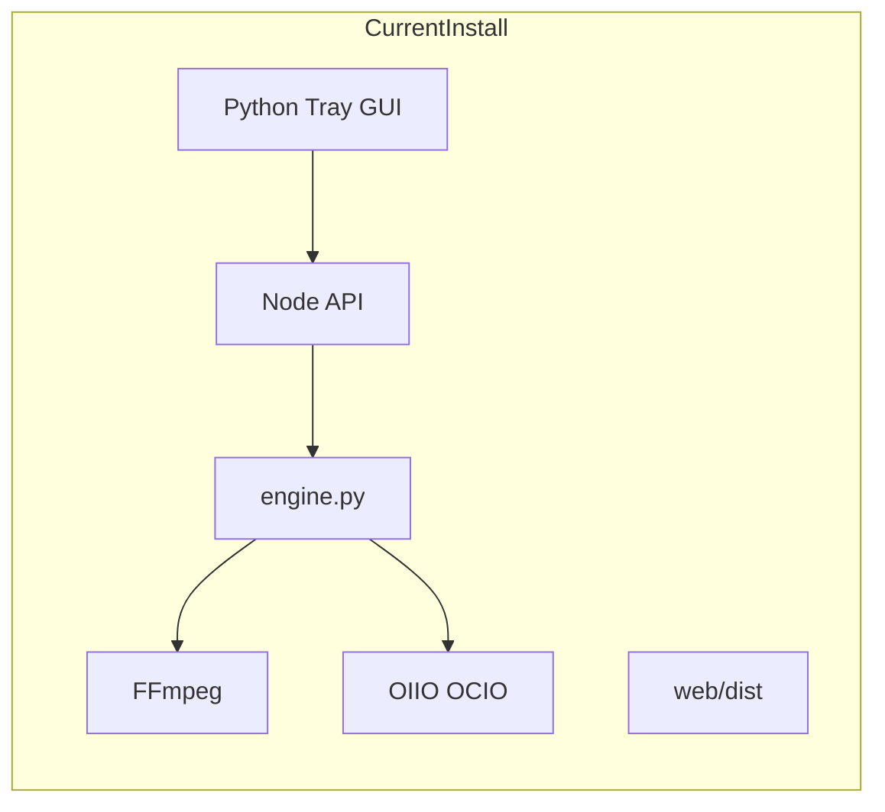
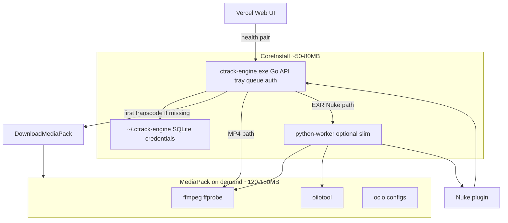

# CTrack Engine Upgrade Plan — Lightweight Install (Go core + optional media pack)

**Status:** Planned (not started)  
**Last updated:** 2026-08-03

## Overview

The current installer is heavy because it bundles Node, full Python+GUI (Tk/CTk/opencv), FFmpeg, OpenImageIO, OCIO, node_modules, and embedded web assets in one shot (~500MB–1GB). A phased plan can cut first install to ~50–80MB with a Go native core + on-demand media pack while keeping EXR/Nuke/OIIO transcode.

**Requirement:** Full VFX pipeline locally (EXR/Nuke/OIIO transcode + MP4 + publish upload), with media toolchain as an optional on-demand download.

---

## Why the install is huge today

The release folder ([`scripts/build-release.bat`](../scripts/build-release.bat)) stages **everything** into one Inno package:

| Component | Role | Typical size |
|-----------|------|----------------|
| Portable Python + Tcl/Tk + pip ([`provision-gui-python.ps1`](../scripts/provision-gui-python.ps1)) | Tray, settings, login card, `engine.py` worker | ~80–150MB+ (opencv-headless adds a lot) |
| FFmpeg ([`ensure-engine-runtime.ps1`](../scripts/ensure-engine-runtime.ps1)) | MP4 / sequence transcode | ~80–100MB |
| OpenImageIO + OCIO | EXR / color pipeline | ~30–80MB |
| Node runtime + `node_modules` ([`embed-node.ps1`](../scripts/embed-node.ps1), release `npm install`) | Express API, queue, S3, auth | ~80–150MB+ |
| Embedded `web/dist` | Local static UI (redundant with Vercel) | ~5–15MB |

The **business logic** (HTTP API, SQLite queue, S3 upload, pairing) is small. The **media toolchain + duplicate runtimes + Python GUI** dominate disk use.

---

## Is Go or C++ viable?

**Yes for the shell (API + tray + queue + auth + updates).** Neither Go nor C++ removes the need for **FFmpeg / OIIO / Nuke** for the full VFX pipeline — those stay as subprocesses or an optional downloadable pack.

| Approach | Install size (core) | Dev effort | Fit for this repo |
|----------|-------------------|------------|-------------------|
| **Go single binary** (`ctrack-engine.exe`) | ~15–30MB | Medium (rewrite API layer) | **Best first native target** — static binary, systray, SQLite, AWS SDK, subprocess orchestration |
| **C++ Win32 tray + HTTP** | ~5–15MB | High | Smallest binary, but slowest path given existing TS/Python investment |
| **Keep Node, slim payload** | ~100MB+ still | Low | Quick wins only, not “lightweight” |

**Recommendation:** Go for **core engine**; keep a **thin Python worker** (no GUI) only for Nuke script orchestration until those paths are ported to Go subprocess calls. Drop Python GUI entirely — tray/settings already have a browser path via [`/link-engine`](../web/src/pages/LinkEnginePage.tsx) and Vercel.

---

## Target architecture

**First install:** small signed `CTrackPublishEngine-Setup.exe` (Go binary + slim scripts + SQLite schema).

**First transcode or EXR job:** prompt once → download `CTrackMediaPack-0.1.x.zip` from GitHub Releases (same channel as engine), verify SHA256, extract to `%ProgramFiles%\CTrackPublishEngine\runtime\`.

---

## Phased implementation

### Phase 0 — Quick wins (no rewrite, ~30–40% smaller, 1–2 days)

Do these in the current Node/Python stack before any Go work:

1. **Stop shipping `web/dist` in the engine installer** — users already use https://ctrackpublishweb.vercel.app. Remove `web/` staging from [`build-release.bat`](../scripts/build-release.bat) for installer builds only.
2. **Lazy media runtime** — move FFmpeg/OIIO/OCIO out of [`build-release.bat`](../scripts/build-release.bat) / [`CTrackEngine.iss`](../installer/CTrackEngine.iss); add `scripts/download-media-pack.ps1` + engine endpoint `POST /api/runtime/ensure` that downloads pack on first use (mirror logic from [`ensure-engine-runtime.ps1`](../scripts/ensure-engine-runtime.ps1)).
3. **Split GitHub Release assets** — publish `CTrackPublishEngine-Setup.exe` + `CTrackMediaPack-{version}.zip` in [`release-publish.ps1`](../scripts/release-publish.ps1).
4. **Web wizard copy** — update [`EngineConnectionWizard`](../web/src/components/engine/EngineConnectionWizard.tsx) to mention optional media pack download after install.

**Outcome:** Installer drops from “everything” to core + Node/Python GUI; media pack downloaded once when needed.

### Phase 1 — Remove Python GUI (~100MB+ saved, ~1 week)

Replace Python tray/settings with Go systray:

- Tray menu: Start engine, Sign in (open `/link-engine`), Open web app, Check updates, Quit — replicate [`tray_app.py`](../engine/python/gui/tray_app.py) behavior.
- Settings / login card → **browser-only** (already supported by [`login_prompt.py`](../engine/python/gui/login_prompt.py) flow via web).
- Remove from release: customtkinter, pystray, Pillow GUI stack from [`provision-gui-python.ps1`](../scripts/provision-gui-python.ps1) GUI path.
- Launcher: single `ctrack-engine.exe` instead of `start-engine-tray.vbs` chain.

### Phase 2 — Go native API core (2–4 weeks)

New package e.g. `engine-go/`:

| Module | Reimplement from | Notes |
|--------|------------------|-------|
| HTTP server `:7777` | [`engine/src/server.ts`](../engine/src/server.ts) | Keep same routes web/Nuke depend on |
| SQLite queue | [`queue-manager.ts`](../engine/src/queue-manager.ts) | `modernc.org/sqlite` or `crawshaw.io/sqlite` |
| S3 / hybrid upload | [`s3-manager.ts`](../engine/src/s3-manager.ts) | `aws-sdk-go-v2` |
| Auth / pairing | [`auth-store.ts`](../engine/src/auth-store.ts) | Same `credentials.json` format |
| Updates | [`update-service.ts`](../engine/src/update-service.ts) | GitHub Releases + `engine-download` edge |
| Python bridge | [`python-manager.ts`](../engine/src/python-manager.ts) | Spawn slim `engine.py` stdin/JSON for Nuke/OIIO routes only |

**MP4 transcode in Go:** spawn `ffmpeg.exe` directly (no Python) for paths handled by [`transcode.py`](../engine/python/modules/transcode.py) without Nuke.

**EXR pipeline:** keep Python [`transcode_router.py`](../engine/python/modules/transcode_router.py) until ported — Nuke + OIIO + OCIO ordering is the complex part.

### Phase 3 — Slim Python worker only (optional cleanup)

- Strip `engine/python/gui/` from installer entirely.
- Minimal portable Python **only** if Nuke bridge still needs it (~40MB standalone, no opencv if thumbnails use FFmpeg-only path).
- Long-term: replace Nuke orchestration with Go calling `nuke.exe -t` + existing [`nuke_render.py`](../engine/python/modules/nuke_render.py) logic ported to Go — then Python can be removed completely.

---

## What we are NOT recommending

- **“Go script” without media pack** — still need FFmpeg/OIIO for full VFX; a script alone does not shrink transcode.
- **Full C++ rewrite of transcode/OCIO** — months of risk for marginal size win vs subprocess + media pack.
- **Cloud-only transcode** — conflicts with full local pipeline requirement.

---

## Installer UX after change

1. User downloads small **Engine Setup** (~50–80MB after Phase 2).
2. Tray starts; web pairs via existing wizard.
3. On first publish/transcode: “Download media components (~150MB)? Required for EXR/MP4 processing.”
4. One-time download; cached under install `runtime\`.

---

## Success metrics

| Milestone | Target installer | Target after media pack |
|-----------|------------------|-------------------------|
| Phase 0 (lazy pack) | ~200–350MB | +120–180MB on demand |
| Phase 1 (no Py GUI) | ~120–200MB | same |
| Phase 2 (Go core) | **~50–80MB** | **~170–250MB total** |

---

## Risks and mitigations

- **API compatibility** — web and Nuke call fixed routes; Phase 2 must preserve [`engine/docs/API.md`](../engine/docs/API.md) or version gate.
- **Antivirus** — smaller signed Go binary helps; still need EV/OV cert ([`CODE_SIGNING.md`](./CODE_SIGNING.md)).
- **Facility offline installs** — offer full “Engine + Media” combined installer variant for air-gapped sites (optional checkbox in Inno).

---

## Suggested starting point

Begin with **Phase 0** (low risk, immediate user benefit) while designing `engine-go/` API parity list from `server.ts`. That validates lazy media pack + smaller installer without blocking current releases.

---

## Checklist

- [ ] Phase 0: Exclude `web/dist` from installer release staging; keep Vercel as sole web UI
- [ ] Phase 0: Build `CTrackMediaPack` zip (FFmpeg+OIIO+OCIO); lazy download on first transcode via engine API
- [ ] Phase 0: Publish core setup + media pack as separate GitHub Release assets in `release-publish.ps1`
- [ ] Phase 1: Replace Python tray/GUI with Go systray; browser-only sign-in and settings
- [ ] Phase 2: Implement `engine-go` with API/queue/auth/S3 parity to `server.ts`; spawn slim Python for Nuke/OIIO routes
- [ ] Phase 2: New Inno setup shipping `ctrack-engine.exe` + optional combined media-pack task for offline sites
