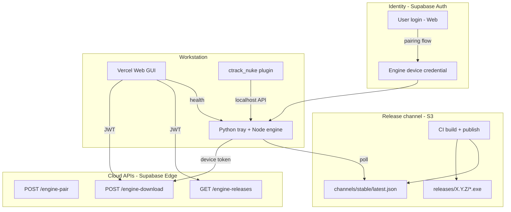
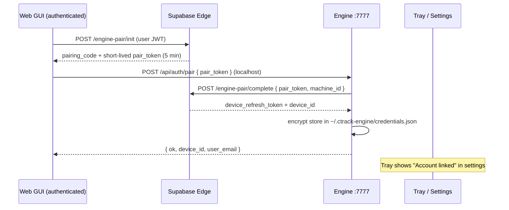

# CTrack Publish — Systematic Plan

**Release channel · Engine auth · S3 downloads · Auto-update · Web install wizard**

Version: 1.0 · Last updated: 2026-05-24

This document defines the end-to-end system for building, publishing, downloading, installing, and auto-updating the CTrack Publish Engine and related clients (web GUI, Nuke plugin). It extends the architecture already in place: Vercel web + Supabase auth + local engine on `127.0.0.1:7777` + S3/MinIO for facility storage.

---

## 1. Goals

| Goal | Description |
|------|-------------|
| **One-click release** | Tag/build → artifacts on S3 → `latest.json` updated automatically |
| **No manual download links** | Web and tray always resolve the current installer from the release channel |
| **Secure downloads** | Installers are not public; only authenticated users/devices get presigned URLs |
| **Engine login / pairing** | Local engine holds a **device credential** tied to the Supabase user — required for auto-update and optional for cloud APIs |
| **Web guides install** | If engine is missing/offline, authenticated web UI offers download + troubleshoot |
| **Pro auto-update** | Tray polls version, downloads update with device auth, verifies SHA256, silent Inno upgrade |
| **Firewall-safe** | Private Network Access (PNA), CORS, loopback-only API, documented Windows rules |

---

## 2. System overview



**Principle:** AWS keys live only in **CI** and **server-side Edge Functions**. Neither the web bundle nor the engine installer embeds S3 secrets.

---

## 3. Identity and authentication model

### 3.1 Three trust domains

| Domain | Auth | Purpose |
|--------|------|---------|
| **Web GUI** (Vercel) | Supabase session (JWT in browser) | App UI, first-time download, pairing initiator |
| **Engine** (localhost) | Device credential + optional local token | Auto-update, cloud release API, optional API hardening |
| **Local API** (`:7777`) | Loopback trust today; optional Bearer after pairing | Queue, transcode, Nuke, settings |

### 3.2 Why the engine needs login (pairing)

Auto-update and authenticated downloads **must not** use:

- Public S3 buckets for `.exe` files
- AWS access keys shipped inside the installer
- Unauthenticated URLs that anyone can scrape

Instead:

1. User logs in on **web** (existing Supabase auth).
2. User **pairs** the workstation engine with that account (one-time, ~30 seconds).
3. Engine stores a **device refresh token** (encrypted on disk).
4. Engine calls Supabase Edge Functions with the device token to obtain **presigned S3 URLs** for installers/updates.

This matches industry practice (Docker Desktop, Figma desktop, 1Password CLI device keys).

### 3.3 Pairing flow (recommended: web-initiated)



**Alternative UX:** Tray shows a 6-digit code → user enters it on web (`/link-engine`). Same backend exchange.

### 3.4 Credential storage (engine)

Path: `%USERPROFILE%\.ctrack-engine\credentials.json` (DPAPI-encrypted on Windows)

```json
{
  "version": 1,
  "deviceId": "uuid",
  "refreshToken": "<encrypted>",
  "userId": "supabase-user-uuid",
  "pairedAt": "ISO8601",
  "lastRefreshAt": "ISO8601"
}
```

Tray/settings: **Account → Linked as user@studio.com → Unlink**.

### 3.5 Auth for auto-update vs first install

| Scenario | Who authenticates | How download works |
|----------|-------------------|-------------------|
| **First install** (no engine) | Web user JWT | Web Edge Function → presigned URL → browser download |
| **Auto-update** (engine paired) | Device refresh token | Tray → Edge Function → presigned URL → silent install |
| **Auto-update** (engine not paired) | — | Tray notifies: "Link account in Settings to enable updates"; web can still download manually |
| **CI publish** | GitHub OIDC / IAM role | `aws s3 cp` — no user involved |

### 3.6 Optional: local API Bearer token

After pairing, engine may issue a **local session token** used by the web tab:

- Reduces risk if something other than the user's browser hits localhost (still rare).
- `Authorization: Bearer <local_session>` on `PATCH /api/engine/settings`, etc.
- Token minted at pair time; stored in `sessionStorage` via one-time handoff from pairing response.

**Keep** read-only routes (`GET /health`, `GET /api/publish/jobs`) open on loopback for Nuke plugin unless Nuke also sends local token later.

---

## 4. S3 release channel layout

Dedicated prefix (separate from shot delivery / publish buckets):

```
s3://<bucket>/ctrack-downloads/
├── channels/
│   ├── stable/
│   │   └── latest.json          ← version pointer (public metadata OK)
│   └── beta/
│       └── latest.json
├── releases/
│   └── <semver>/
│       ├── CTrackPublishEngine-Setup.exe
│       ├── CTrackPublishEngine-Setup.exe.sha256
│       ├── CTrackNuke-Setup.exe
│       ├── CTrackNuke-Setup.exe.sha256
│       ├── manifest.json
│       └── RELEASE_NOTES.md
└── index.json                     ← optional history
```

### 4.1 `channels/stable/latest.json` (public-safe subset)

May be public **without** direct exe URLs:

```json
{
  "product": "ctrack-engine",
  "channel": "stable",
  "version": "0.2.0",
  "publishedAt": "2026-05-24T12:00:00Z",
  "minEngineVersion": "0.1.0",
  "artifacts": {
    "engineSetup": {
      "sha256": "...",
      "sizeBytes": 285000000,
      "fileName": "CTrackPublishEngine-Setup.exe"
    },
    "nukePluginSetup": {
      "sha256": "...",
      "sizeBytes": 1200000,
      "fileName": "CTrackNuke-Setup.exe"
    }
  },
  "releaseNotes": "Fixed EXR transcode fallback order.",
  "breaking": false
}
```

**Download URLs are never in this file.** Clients request presigned URLs via authenticated Edge Functions.

### 4.2 Internal `releases/<semver>/manifest.json` (CI-only fields)

Includes S3 keys, build metadata, git SHA, CI run ID — used by Edge Functions to generate presigned URLs.

---

## 5. Supabase backend

### 5.1 Tables

```sql
-- Release catalog (written by CI service role)
create table engine_releases (
  version text primary key,
  channel text not null default 'stable',
  published_at timestamptz not null default now(),
  s3_prefix text not null,
  engine_sha256 text not null,
  engine_size_bytes bigint not null,
  nuke_sha256 text,
  release_notes text,
  breaking boolean default false,
  git_sha text,
  created_by text
);

-- Paired workstations
create table engine_devices (
  id uuid primary key default gen_random_uuid(),
  user_id uuid not null references auth.users(id) on delete cascade,
  machine_id text not null,
  machine_label text,
  engine_version text,
  paired_at timestamptz not null default now(),
  last_seen_at timestamptz,
  revoked_at timestamptz,
  unique (user_id, machine_id)
);

-- One-time pairing tokens
create table engine_pairing_tokens (
  token_hash text primary key,
  user_id uuid not null references auth.users(id),
  expires_at timestamptz not null,
  consumed_at timestamptz
);
```

**RLS:**

- `engine_releases`: authenticated users `SELECT`; inserts via service role only.
- `engine_devices`: users see/manage own devices; admins see all.

### 5.2 Edge Functions

| Function | Auth | Purpose |
|----------|------|---------|
| `engine-pair/init` | User JWT | Create pairing code / pair_token |
| `engine-pair/complete` | pair_token + machine_id | Issue device refresh token |
| `engine-auth/refresh` | Device refresh token | Rotate credentials |
| `engine-download` | User JWT **or** device token | Return presigned S3 URL for artifact |
| `engine-releases/latest` | User JWT (optional for public manifest mirror) | Return latest release row |

**`engine-download` validation:**

1. Verify JWT or device token.
2. Check user/device not revoked.
3. Resolve version (`latest` or explicit semver).
4. Generate S3 presigned GET (15-minute TTL).
5. Log audit row (user, device, version, IP).

---

## 6. Engine API additions

| Method | Path | Auth | Purpose |
|--------|------|------|---------|
| `POST` | `/api/auth/pair` | localhost + pair_token | Complete pairing, store credentials |
| `POST` | `/api/auth/unpair` | localhost | Clear credentials |
| `GET` | `/api/auth/status` | localhost | `{ paired, userId, email?, deviceId? }` |
| `POST` | `/api/auth/refresh` | localhost | Refresh device token via Edge |
| `GET` | `/api/update/check` | localhost | Compare local vs `latest.json` |
| `POST` | `/api/update/download` | localhost + paired | Fetch presigned URL, download to temp |
| `POST` | `/api/update/apply` | localhost + paired | Launch Inno silent upgrade |

Tray menu additions: **Link account**, **Check for updates**, **Install update**.

---

## 7. Web GUI flows

### 7.1 Boot sequence (updated)

```
1. User opens Vercel app → Supabase auth (existing)
2. Parallel:
   a. fetch(127.0.0.1:7777/health) — engine probe (PNA + CORS)
   b. fetch(engine-releases/latest) — cloud manifest (authenticated)
3. Branch:
   ├─ Engine online + paired/auth OK → main app
   ├─ Engine online + not paired → banner "Link this workstation"
   ├─ Engine online + version < latest → "Update available" CTA
   └─ Engine offline/missing → Engine Connection Wizard
```

### 7.2 Engine Connection Wizard (replaces bare error screen)

Steps:

1. **Detect** — explain localhost probe failed (not installed / not running / firewall).
2. **Download** — authenticated presigned URL for latest engine installer.
3. **Install** — run `.exe`, Start Menu shortcut, tray VBS.
4. **Pair** — link engine to logged-in user (pair_token handoff).
5. **Verify** — retry `/health` + show version + EXR backend.
6. **Troubleshoot** — expandable diagnostics (see §9).

### 7.3 Version compare

| Local (`/health.version`) | Remote (`latest.version`) | UI |
|---------------------------|---------------------------|-----|
| none | 0.2.0 | Download installer |
| 0.1.0 | 0.1.0 | OK |
| 0.1.0 | 0.2.0 | Update available |
| 0.1.0 | 0.3.0 (breaking) | Force recommended update + release notes |

---

## 8. Auto-update (tray) — pro workflow

### 8.1 Schedule

- On tray start (after engine up)
- Every 6 hours while running
- Manual: tray menu → Check for updates

### 8.2 Algorithm

```
1. GET channels/stable/latest.json (public metadata)
2. Compare semver with installed version (registry / version file / health)
3. If remote <= local → exit
4. If not paired → notify only ("Link account to install updates")
5. POST /api/update/download
   → engine uses device token → Edge → presigned URL
   → download to %TEMP%\ctrack-update\<version>\
   → verify sha256
6. Notify user → "Install now" / "Later"
7. POST /api/update/apply
   → CTrackPublishEngine-Setup.exe /SILENT /CLOSEAPPLICATIONS /SUPPRESSMSGBOXES
8. Restart tray; log version to engine_devices.last_seen_at
```

### 8.3 Downgrade / channels

- Default channel: `stable` (env `CTRACK_UPDATE_CHANNEL`).
- Beta testers: user flag in Supabase `profiles.update_channel = beta`.
- Never auto-install across major breaking without explicit consent.

---

## 9. Firewall, PNA, and troubleshooting

### 9.1 Browser → localhost (already partially implemented)

Engine must send:

```
Access-Control-Allow-Origin: <Vercel origin>
Access-Control-Allow-Credentials: true
Access-Control-Allow-Private-Network: true
```

Preflight from HTTPS origin to `http://127.0.0.1:7777` requires **Private Network Access** (Chrome/Edge).

`CTRACK_WEB_ORIGINS` in engine env must include every production/preview Vercel URL.

### 9.2 Windows Firewall

Installer optional step (Inno `[Run]`):

```powershell
New-NetFirewallRule -DisplayName "CTrack Engine API (loopback)" `
  -Direction Inbound -Protocol TCP -LocalPort 7777 `
  -Action Allow -Profile Private,Domain -LocalAddress 127.0.0.1
```

Note: binding to `127.0.0.1` only avoids most corporate firewall prompts; document either way.

### 9.3 Web Troubleshoot panel

Automated checks (display pass/fail + fix link):

| # | Check | Pass criteria |
|---|--------|----------------|
| 1 | Engine reachable | `GET /health` 200 within 3s |
| 2 | PNA / CORS | preflight succeeds from web origin |
| 3 | Engine version | semver parsed |
| 4 | Account paired | `GET /api/auth/status.paired` |
| 5 | Update channel | manifest fetch OK |
| 6 | Download auth | Edge function returns 200 (dry-run HEAD) |
| 7 | Port conflict | nothing else on 7777 |
| 8 | Tray running | optional process hint |

Actions: **Copy diagnostics**, **Download engine**, **Open pairing**, **Retry connection**, **Firewall guide**.

---

## 10. Versioning (single source of truth)

New file: `version.json` at repo root:

```json
{
  "engine": "0.2.0",
  "nukePlugin": "0.1.0",
  "web": "0.2.0"
}
```

CI reads this file and propagates to:

- `engine/src/server.ts` (`ENGINE_VERSION` via build inject)
- `installer/CTrackEngine.iss` (`MyAppVersion`)
- `ctrack_nuke/installer/CTrackNuke.iss`
- `channels/stable/latest.json`
- Supabase `engine_releases` row

**Bump rule:** patch = fixes; minor = features; major = breaking API/queue schema.

---

## 11. CI/CD pipeline

### 11.1 Trigger

- Git tag: `v0.2.0` or `engine-v0.2.0`
- Manual: `workflow_dispatch`

### 11.2 Jobs

```yaml
release:
  runs-on: windows-latest
  steps:
    - checkout
    - read version.json
    - npm ci && npm run build -w engine -w web
    - scripts/build-release.bat
    - scripts/build-installer.bat
    - ctrack_nuke/installer/build-installer.bat
    - sha256sum artifacts → .sha256 files
    - aws s3 sync → s3://bucket/ctrack-downloads/releases/$VERSION/
    - scripts/write-latest-json.ps1 → upload channels/stable/latest.json
    - supabase insert engine_releases (service role)
    - (optional) notify Slack
```

### 11.3 Scripts to add

| Script | Role |
|--------|------|
| `scripts/release-bump.ps1` | Semver bump `version.json` |
| `scripts/release-publish.ps1` | Orchestrate build + upload + manifest |
| `scripts/write-latest-json.ps1` | Build public latest.json from artifacts |
| `scripts/add-firewall-rule.ps1` | Called from Inno installer |

### 11.4 Deploy manager behavior

After every successful release:

- `latest.json` pointer moves to new semver **atomically** (upload manifest last).
- Web reads cloud API → always offers current version.
- Paired engines auto-update without you changing any URL in code or docs.

### 11.5 Dev vs Deploy pipelines

| Pipeline | File | Trigger | Actions |
|----------|------|---------|---------|
| **Dev** | `.github/workflows/ctrack-dev.yml` | Push/PR to `main` / `develop` | `npm ci`, build engine + web, Python syntax check |
| **Deploy** | `.github/workflows/ctrack-deploy.yml` | Tag `v*` or `workflow_dispatch` | Deploy 4 Edge Functions → build installers → S3 → `engine_releases` |

Local scripts (see [DEV_AND_DEPLOY.md](./DEV_AND_DEPLOY.md)):

| Script | Role |
|--------|------|
| `scripts/deploy-dev.ps1` | Local dev build (+ optional installer) |
| `scripts/deploy-edge-functions.ps1` | Deploy `engine-pair-*`, `engine-download`, `engine-releases-latest` |
| `scripts/deploy-release.ps1` | Full deploy orchestrator (edge + `release-publish.ps1`) |

GitHub secrets for Deploy: `SUPABASE_ACCESS_TOKEN`, `SUPABASE_URL`, `SUPABASE_SERVICE_ROLE_KEY`, `AWS_*`.

---

## 12. Security summary

| Asset | Exposure | Access control |
|-------|----------|----------------|
| Installers (`.exe`) | Private S3 | Presigned URL via Edge + user/device auth |
| `latest.json` (metadata) | Public or auth-read | No direct download URLs inside |
| AWS IAM keys | CI + Edge only | Never in client bundles |
| Device refresh token | Local disk encrypted | Revocable in Supabase |
| Local engine API | Loopback | Optional Bearer after pairing |
| Publish queue / transcode | Loopback | Nuke + web on same machine |

**Never:** public bucket ACL on installers, long-lived presigned URLs in git, AWS keys in engine installer.

---

## 13. Implementation phases

### Phase A — Release channel (foundation)

- [x] Add `version.json` + bump script (`scripts/release-bump.ps1`)
- [x] S3 prefix + CI publish workflow (`scripts/release-publish.ps1`, `.github/workflows/release-engine.yml`)
- [x] `write-latest-json.ps1` + atomic pointer update (`scripts/write-latest-json.ps1`, channel upload in `scripts/release-publish.ps1`)
- [x] Supabase `engine_releases` table (`ctrack_v0/supabase/migrations/098_engine_release_and_device_auth.sql`, mirror `supabase/migrations/021_engine_release_and_device_auth.sql`)

### Phase B — Auth & pairing

- [x] Edge Functions: pair/init, pair/complete, download, releases-latest (`ctrack_v0/supabase/functions/engine-*`)
- [x] Supabase tables: `engine_devices`, `engine_pairing_tokens`, `engine_device_credentials`, `engine_download_audit` (migration 098)
- [x] Engine routes: `/api/auth/*` (`engine/src/auth-store.ts`, `engine/src/server.ts`)
- [x] Credential store (`~/.ctrack-engine/credentials.json`; DPAPI hardening optional follow-up)
- [x] Tray/settings: Link account / Unlink (`engine/python/gui/settings_window.py`)

### Phase C — Web install wizard

- [x] `EngineConnectionWizard` component
- [x] Authenticated download button (Edge Function)
- [x] Pairing handoff from web → localhost
- [x] Version compare banner (update available)

### Phase D — Tray auto-update

- [x] `/api/update/*` routes
- [x] Manifest poll + sha256 verify
- [x] Silent Inno apply
- [x] Menu: Check for updates
- [x] Background poll every 24 hours (startup + daily)
- [x] Download fallback: AWS S3 primary, MinIO backup (`backupUrl` from `engine-download`)

### Phase E — Troubleshoot & firewall

- [x] Connection test suite in web
- [x] Firewall rule in installer
- [x] Diagnostic export
- [x] Help/docs page

### Phase F — Nuke plugin channel (optional)

- [x] Separate artifact in manifest
- [x] Nuke menu version check
- [x] Download via same Edge Function (`product=nuke`)
- [x] Local engine route `GET /api/update/check?product=nuke` delegates to update service

### Phase G — Workstation GUI & first-run sign-in (2026-05)

- [x] Python system tray (`engine/python/gui/tray_app.py`) — single instance, engine lifecycle, update poll
- [x] Sign-in card (`login_prompt.py`) — slides from taskbar, opens browser to `/link-engine`
- [x] Settings window (`settings_window.py`) — General, Account, Review & MP4, Nuke, Tools
- [x] Engine console (`engine_window.py`) — logs tail + recent publish jobs
- [x] Auth routes: `/api/auth/login-url`, `/api/auth/status`, `/api/logs/tail`
- [x] Web pairing page `/link-engine` (`web/src/pages/LinkEnginePage.tsx`)
- [x] Local credential read (`auth_local.py`) + stale lock recovery (`instance_lock.py`)
- [x] Engine bootstrap before sign-in (`engine_bootstrap.py`)
- [x] Tray second-launch opens sign-in when unpaired
- [ ] DPAPI-encrypted credentials on Windows
- [ ] Verified end-to-end first-run on clean machine (acceptance §15)

See [DEVELOPMENT_STATUS.md](./DEVELOPMENT_STATUS.md) for file map and current gaps.

### Phase H — CI & local deploy tooling
- [x] GitHub Dev pipeline (`.github/workflows/ctrack-dev.yml`)
- [x] GitHub Deploy pipeline (`.github/workflows/ctrack-deploy.yml`)
- [x] Dev/deploy docs (`docs/DEV_AND_DEPLOY.md`)

---

### Web (Vercel)

```env
VITE_SUPABASE_URL=
VITE_SUPABASE_ANON_KEY=
VITE_ENGINE_URL=http://127.0.0.1:7777
VITE_ENGINE_MANIFEST_URL=https://<cdn-or-supabase>/engine-releases/latest
```

### Engine (user `.ctrack-engine/.env`)

```env
CTRACK_WEB_ORIGINS=https://ctrackpublishweb.vercel.app,http://localhost:5173
CTRACK_ENGINE_PORT=7777
CTRACK_UPDATE_CHANNEL=stable
SUPABASE_URL=          # for device token refresh (public URL only)
CTRACK_EDGE_BASE=      # Supabase functions URL
```

### CI (GitHub secrets)

```env
AWS_ACCESS_KEY_ID=
AWS_SECRET_ACCESS_KEY=
AWS_S3_BUCKET=
SUPABASE_SERVICE_ROLE_KEY=
```

---

## 15. Success criteria

- [ ] Releasing `v0.2.0` updates download offer everywhere within 5 minutes, zero manual link edits.
- [ ] Unauthenticated clients cannot download installers.
- [ ] Paired engine auto-updates with sha256 verification.
- [ ] Web user with valid login can install engine when localhost probe fails.
- [ ] Troubleshoot panel identifies PNA/CORS/firewall issues in plain language.
- [ ] Nuke + web continue to work against localhost API without cloud dependency during publish.

---

## 16. Related docs

- [Development status — what is built](./DEVELOPMENT_STATUS.md)
- [Dev & deploy runbook](./DEV_AND_DEPLOY.md)
- [Engine HTTP API](../engine/docs/API.md)
- [README — build & install](../README.md)
- [ctrack_nuke README](../../ctrack_nuke/README.md)

---

## Appendix A — Pairing sequence (tray + web)

1. User starts **CTrack tray** (`scripts/start-engine-tray.vbs`) — Node engine starts on `:7777`.
2. If not paired, **sign-in card** slides up from taskbar; user clicks **Sign in**.
3. Browser opens `{CTRACK_WEB_URL}/link-engine` → Google OAuth.
4. Web (authenticated) calls `engine-pair-init` → receives `pairToken`.
5. Web calls `POST http://127.0.0.1:7777/api/auth/pair` with `pairToken` (**engine must be running**).
6. Engine calls `engine-pair-complete` edge function → writes `~/.ctrack-engine/credentials.json`.
7. Sign-in card detects pairing → **Connected** → slides down → **Settings (Account)** opens.
8. Tray menu updates; subsequent starts skip sign-in.

**If step 5 fails:** engine offline or stale tray — restart tray, ensure `curl http://127.0.0.1:7777/health` returns OK, retry sign-in.

## Appendix B — First-time user journey

1. Install engine (Inno) or run from dev tree.
2. Start tray → sign-in card appears if not paired.
3. Sign in via browser → engine links account.
4. Optional: open Vercel web UI for facility setup / publish.
5. Install Nuke plugin → **CTrack** menu → Publish Write.

## Appendix C — Returning user with outdated engine

1. Web or tray detects `0.1.0` local vs `0.2.0` remote.
2. Tray: "Update available" notification.
3. User clicks Install (or auto if policy allows).
4. Silent upgrade; tray restarts.
5. `engine_devices.engine_version` updated on next pair refresh.
